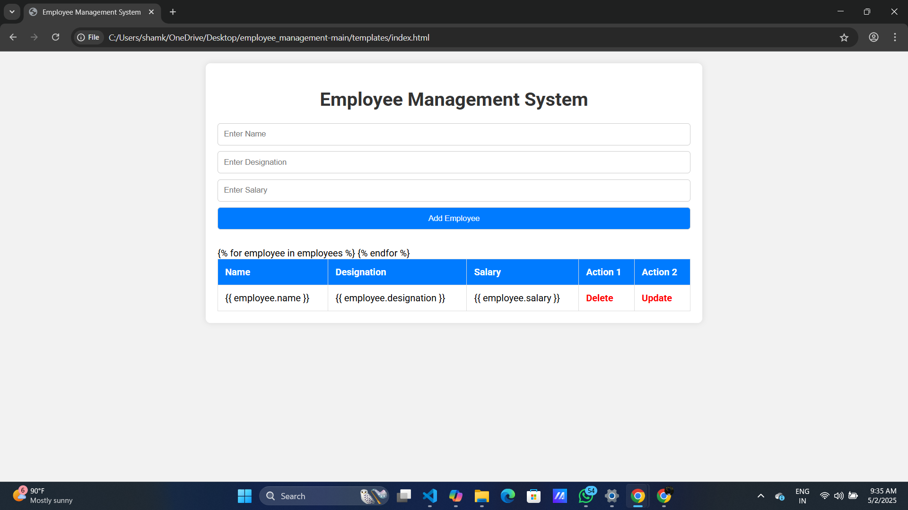
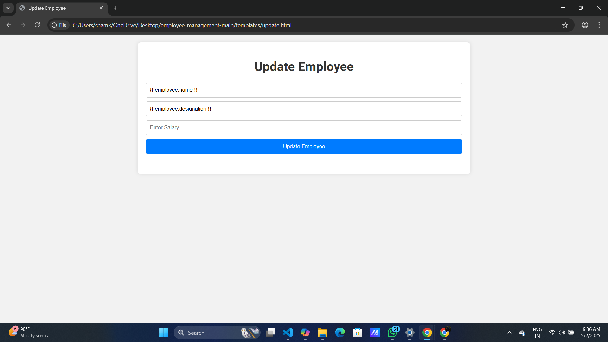

# 🧑‍💼 Employee Management System

A web-based Employee Management System built to streamline HR operations such as managing employee records, roles, and attendance.

## 📸 Screenshots

| Dashboard | Update |
|------------|-----------|
|  |  |

## 📦 Features

- ✅ Admin login and employee management
- 🗂️ Add, view, update, and delete employee details
- 📅 Track attendance and leaves
- 🔐 Secure authentication
- 📊 Dashboard for quick insights

## 🏗️ Tech Stack

- **Frontend**: HTML, CSS, Bootstrap, JavaScript
- **Backend**: Python (Flask/Django)
- **Database**: mongoDB

## ⚙️ Setup Instructions

1. **Clone the repository**
   ```bash
   git clone https://github.com/yourusername/employee_management.git
   cd employee_management
